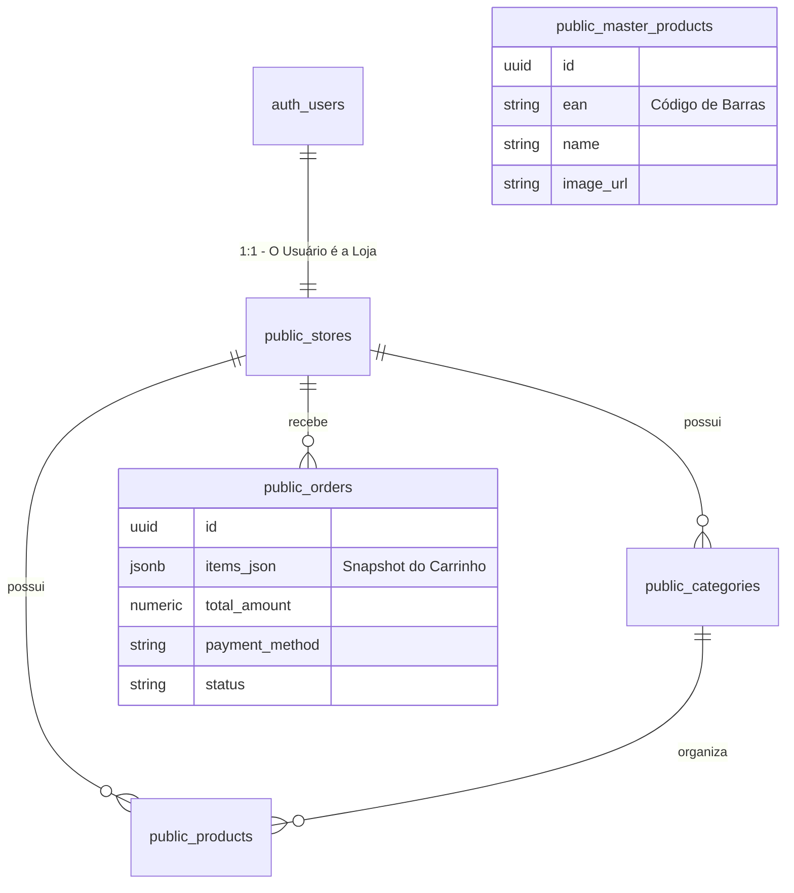

# 📘 Arquitetura de Dados & Design - Project Idun

## 1. Visão Geral e Decisões de Engenharia
O **Project Idun** opera sob um modelo de arquitetura **SaaS Multi-Inquilino (Multi-tenant)**. O objetivo central é permitir que múltiplos mercados utilizem a mesma infraestrutura de banco de dados, mantendo um isolamento estrito de dados entre eles.

### Por que Supabase + RLS?
Optamos por delegar a camada de segurança diretamente ao Banco de Dados (PostgreSQL) através de **Row Level Security (RLS)**, em vez de tratá-la no código da aplicação (Node/React).

* **Segurança Profunda:** Mesmo que o desenvolvedor esqueça de filtrar uma query no Front-end (`select * from products`), o banco de dados retornará apenas as linhas que o usuário tem permissão para ver.
* **Performance:** Reduz a necessidade de verificações complexas no lado do servidor.
* **Integridade:** Garante que um "Mercado A" jamais acesse dados do "Mercado B", prevenindo vazamento de dados entre inquilinos.

---

## 2. Diagrama Entidade-Relacionamento (ERD)

Abaixo, a representação visual das relações entre as tabelas do sistema.

---

## 3. Dicionário de Dados e Decisões de Schema

Detalhamento das tabelas críticas e a justificativa para os tipos de dados escolhidos.

### A. Tabela `stores` (Core SaaS)
Representa a entidade do cliente (o dono do mercado).
* **`id` (PK/FK):** Vinculado diretamente ao `auth.users.id`.
    * *Justificativa:* Força uma relação 1:1 estrita. O ID de autenticação é o mesmo ID da loja, simplificando as políticas de segurança.
* **`slug` (Unique):** Identificador legível (ex: `app.com/mercadodoze`).
    * *Justificativa:* URLs amigáveis aumentam a confiança do consumidor final e facilitam o compartilhamento.
* **`is_open` (Boolean):** Controle operacional.
    * *Justificativa:* Funciona como um "Kill Switch" para o dono fechar a loja imediatamente em momentos de alta demanda ou fora do expediente.

### B. Tabela `products` (Catálogo)
* **`price` (Numeric):**
    * *Justificativa:* O uso de `float` é proibido para valores monetários devido a erros de precisão em ponto flutuante. O tipo `numeric` garante precisão decimal exata para cálculos financeiros.
* **`store_id` (FK):**
    * *Justificativa:* Coluna pivô para o RLS. É o filtro primário de visibilidade dos dados.

### C. Tabela `orders` (Histórico de Pedidos)
* **`items_json` (JSONB):** Armazena o array de itens do carrinho (`[{nome, qtd, preco}]`).
    * *Justificativa (Snapshot Pattern):*
        1.  **Imutabilidade:** Garante que o histórico do pedido preserve o preço do item *no momento da compra*, mesmo que o preço do produto mude depois.
        2.  **Simplicidade:** Elimina a necessidade de uma tabela associativa (`order_items`) complexa, já que não precisamos de queries analíticas profundas item a item neste momento.

### D. Tabela `master_products` (Base de Conhecimento)
Tabela pública contendo dados genéricos de produtos (EAN, Nome, Foto).
* *Justificativa:* Resolve o problema do "Cold Start". Permite que novos lojistas importem produtos prontos ao invés de cadastrar tudo manualmente, reduzindo a fricção de entrada.

---

## 4. Modelo de Segurança (RLS Policies)

As regras abaixo são aplicadas automaticamente pelo PostgreSQL em cada transação.

| Tabela | Operação | Permissão | Regra de Negócio (Lógica) |
| :--- | :--- | :--- | :--- |
| **stores** | `SELECT` | **Público** | Qualquer usuário pode ler dados básicos da loja (necessário para renderizar o site). |
| **stores** | `UPDATE` | **Dono** | Permitido apenas se `auth.uid() == id` da loja. |
| **products** | `SELECT` | **Público** | Clientes precisam visualizar o catálogo para comprar. |
| **products** | `ALL` | **Dono** | CRUD completo permitido apenas onde `store_id == auth.uid()`. |
| **orders** | `INSERT` | **Público** | Qualquer usuário (anônimo ou logado) pode enviar um pedido. |
| **orders** | `SELECT` | **Dono** | Apenas o dono da loja visualiza os pedidos recebidos (Isolamento total). |
| **categories**| `SELECT` | **Público** | Necessário para navegação do catálogo. |

---

## 5. Automação de Infraestrutura (Triggers)

Para garantir a consistência dos dados, utilizamos Database Triggers.

**Funcionalidade: Auto-Provisionamento de Loja**
* **Gatilho:** Evento `INSERT` na tabela `auth.users` (quando um usuário se cadastra).
* **Ação:** Executa a função `public.handle_new_user()`.
* **Resultado:** Cria automaticamente uma entrada na tabela `public.stores` com dados padrão.
* **Benefício:** Garante que não existem "usuários órfãos" no sistema e elimina código de verificação de existência de loja no Front-end.
